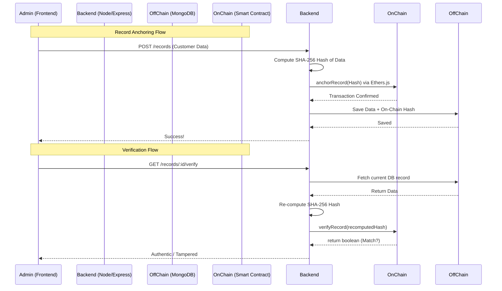

# Bank Record Storage System Using Blockchain 🏦🔗

For a complete fresh-machine installation procedure, see [SETUP.md](SETUP.md).

A full-stack, hybrid web application designed to demonstrate the real-world application of blockchain technology in securing traditional banking records.

By storing heavy, sensitive bank records off-chain in a traditional database (MongoDB) and anchoring a cryptographic hash of those records on-chain (Ethereum Smart Contract), this system achieves **immutable proof-of-integrity** without the prohibitive gas costs of storing full data on the blockchain.

---

## 🏗️ System Architecture

This project implements a hybrid Off-Chain/On-Chain architecture:



### Why this architecture?
1. **Cost Efficiency:** Storing large amounts of text (customer details, transaction logs) directly on Ethereum is incredibly expensive. We only store a 32-byte hash.
2. **Privacy:** Bank records contain PII (Personally Identifiable Information). Public blockchains are transparent. By storing data off-chain, we maintain privacy while using the blockchain purely as a notary.
3. **Data Integrity:** If a malicious actor hacks the MongoDB and alters a record, the `verifyRecord` function will instantly flag it because the new hash of the tampered data will no longer match the immutable hash secured by the smart contract.

---

## 🛠️ Technology Stack

- **Frontend:** React, Vite, TailwindCSS (v3), React Router, Lucide Icons, Ethers.js (v6).
- **Backend:** Node.js, Express, Mongoose (MongoDB), JSON Web Tokens (JWT), Bcrypt.
- **Blockchain:** Solidity, Hardhat (Local Node), Ethers.js.
- **Cryptography:** Native Node `crypto` module (SHA-256).

---

## 🚀 Getting Started

Follow these steps to run the complete hybrid system locally.

### 1. Start the Blockchain (Hardhat Node)
Open a terminal and run the local Ethereum node. Leave this terminal open.
```bash
# In the root directory
npx hardhat node
```

*Note: Hardhat provides several test accounts with 10,000 fake ETH. The first account (`Account #0`) is used as the Admin deployer.*

### 2. Start the Backend API
You will need **MongoDB** installed and running locally on `mongodb://127.0.0.1:27017` (or update the `.env` with a MongoDB Atlas URI).

Open a second terminal:
```bash
cd backend
npm install
npm run dev
```
*The backend will run on `http://localhost:5000`.*

### 3. Start the Frontend Application
Open a third terminal:
```bash
cd frontend
npm install
npm run dev
```
*The frontend will run on `http://localhost:5173`.*

---

## 🎮 How to Demo the App (For Recruiters)

1. **Register & Login:** Open the frontend, click Register, create an `admin` account, and log in.
2. **Connect Wallet:** Click "Connect Wallet" in the navbar to connect MetaMask (ensure MetaMask is set to your `Localhost 8545` network).
3. **Anchor a Record:** Click "New Record", enter fake banking details, and submit. The backend will hash this data and send a real transaction to the local Hardhat blockchain.
4. **View Analytics:** Return to the Dashboard to see your newly anchored record and the global system analytics.
5. **Verify Integrity:** Click "View Details" on your record, then click **Verify Integrity**. You will see a green success banner proving the off-chain data matches the on-chain hash.
6. **The Hack (Tamper Demo):** As an admin, click **Simulate Hack**. This maliciously alters the record in MongoDB *without* updating the blockchain.
7. **Catch the Hacker:** Click **Verify Integrity** again. The system will catch the discrepancy, the UI will flash red, and it will flag the record as **Tampered!**

---

## 📝 License
This project was built as a portfolio placement piece. Feel free to fork and use it as a reference for hybrid blockchain architectures!
